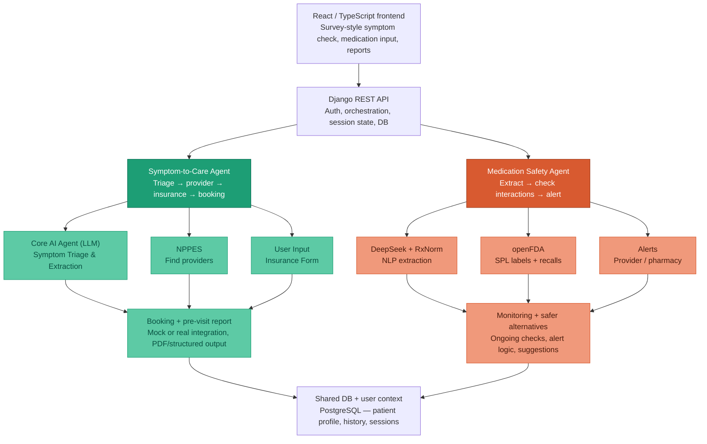

# System Architecture

## Symptom survey and LLM (frontend + Django)

The **Symptom Check** flow (`/symptom-check`) is a **three-step survey** in React: intake (free text + insurer), dynamic follow-up questions, then illustrative differentials and facility/cost sections.

- **Prompts** for the survey live in `frontend/src/symptomCheck/prompts/` (`followup_context.txt`, `followup_round2_context.txt`, `results_context.txt`). The SPA loads them at build time (Vite `?raw`), sends them as `system_prompt` on each call, and sends structured `user_payload` (symptoms, insurer label, follow-up answers, and on the final call the browser **active medication regimen** — see below).
- **Runtime:** the SPA `POST`s to **`/api/symptom/survey-llm/`** (`SymptomSurveyLlmView`) with `{ phase, system_prompt, user_payload }` and optional **`session_id`** (UUID string) to continue the same `SymptomSession` after the first turn, using **`apiClient`** and **`Authorization: Bearer`**. Django calls the configured OpenAI-compatible or Anthropic API (keys in `.env`) and returns `{ raw_text, phase, session_id }`; the browser parses and validates JSON before rendering.
- **Survey phases** (not chat-first): (1) `followup_questions` → variable `questions[]` with `input_type` for controls; (2) optional `followup_questions_round_2` if the model returns more questions; (3) `condition_assessment` → conditions, severities, and **`care_taxonomy`** (NUCC taxonomy codes for routing).

### Pre-visit report and medications (structured survey)

After **`condition_assessment`**, Django runs **`build_pre_visit_report`** (`api/services/report_service.py`): it feeds the persisted survey transcript plus a **Known medications** block into the pre-visit LLM (`api/prompts/pre_visit_report_system.txt`) and stores JSON on `SymptomSession.pre_visit_report`.

- **Active regimen from the browser:** The Medication Safety list is stored per signed-in account in **`localStorage`** (`frontend/src/medicationSafety/medicationRegimenStorage.ts`), not only on the server. For the **final** survey call only, `requestConditionAssessment` in `frontend/src/symptomCheck/symptomLlmClient.ts` attaches **`user_payload.active_medications`**: an array of objects derived from `loadActiveRegimen()` (name, optional common/scientific names, dosage mg, frequency, time to take, refill horizon). The server persists this on the survey turn in `ai_conversation_log`, then **`medication_lines_for_session`** formats one human-readable line per drug (including those details) for the report prompt and for the merged **`medications`** list in the saved report. If the client sends no usable `active_medications`, the report falls back to the latest **`MedicationProfile`** names for that user (legacy path used by chat-only sessions or users who never synced regimen in the survey).
- **Merge:** Profile/survey medication lines are merged with the LLM’s `medications` array with **deduplication by medication name**, including when the model returns prose lines (e.g. `Drug 10 mg daily…`) that refer to the same drug as a formatted browser line (`Drug — dosage: …`), so each drug appears once in the saved report (`api/services/report_service.py`, `_medication_primary_key`).
- **Reports (`/reports`):** `frontend/src/pages/ReportsPage.tsx` lists symptom sessions and reads `pre_visit_report` for patient-friendly sections and PDF export. **View report** on the Symptom Check results step **`refetch`es** the sessions query, navigates to **`/reports?session=<SymptomSession.public_id>`**, and passes **`state: { scrollToTop: true }`**. The Reports route **refetch**es if the `session` query id is not yet in the cache (so the new check is selected instead of snapping to the first row), shows a brief loading state while fetching, and runs **`scrollAppToTop`** (`frontend/src/utils/scrollAppToTop.ts`) in **`useLayoutEffect`** when that navigation state is present so the app shell scrolls to the top.
- **Nearby facilities:** On the results step (after the second LLM call), the SPA calls **`POST /api/symptom/nearby-facilities/`** with the user’s validated US address (from step 1) and `taxonomy_codes` from `care_taxonomy`. Django runs **`api/services/nppes_nearby.py`**: US Census geocoding for the user and each NPPES practice location, CMS NPI Registry (NPPES) search by ZIP + taxonomy + organization (`NPI-2`), then **relevance-weighted ranking** (`api/services/nppes_relevance.py`: name/type/org heuristics; NPPES has no reviews) combined with distance, then location de-duplication. The client module `frontend/src/symptomCheck/nppesFacilitiesClient.ts` validates JSON and the page renders facilities with Google Maps links.
- **Conversational chat** (`POST /api/symptom/chat/`) uses a separate system prompt file on the server: `api/prompts/symptom_chat_system.txt` (JSON reply with `assistant_message`, `triage_level`, etc.).

The diagram above remains the target for deeper orchestration (sessions, NPPES); the survey path already routes LLM traffic through **Django** for credential safety.

### Client-side session persistence (Symptom Check survey)

The **`/symptom-check`** React page mirrors survey state to **`localStorage`** under a versioned key (`frontend/src/symptomCheck/symptomCheckSession.ts`, currently **v2** including intake **address** fields) so users can recover progress after a **refresh** or **in-app navigation** in the same browser profile. On load, if a recoverable snapshot exists, the UI offers **Resume** (restore answers and step) or **Start over** (clear storage and reset the wizard). Older **v1** snapshots are upgraded in-memory to v2 with an empty address.

- **In-flight LLM calls:** If the user leaves while `requestFollowUpQuestions` or `requestConditionAssessment` is pending, the snapshot records which phase was active. Choosing **Resume** re-sends the same API request with the saved intake or follow-up payload; this mirrors server-side stateless survey turns (`POST /api/symptom/survey-llm/`) and does not duplicate server session state.

- **Scope:** Persistence is **browser-local only** (not synced across devices or accounts). Clearing site data or using another browser profile starts fresh.

- **Default address (account):** On **Settings & profile** (`/settings`), users can save a **validated US address** to the account via **`PATCH /api/auth/me/`** (`default_address` JSON or `null` to clear). It uses the same field rules as step 1 (`frontend/src/symptomCheck/addressValidation.ts` and `users/serializers.py` `DefaultAddressSerializer`). When the Symptom Check intake step loads with **no address** in local state, the SPA calls **`GET /api/auth/me/`** and prefills from `default_address` when present, shows a short notice, and offers **Clear address** to blank fields without immediately re-applying the saved default in that visit.

## Medication Safety UI and extraction API

The **Medication Safety** area (`/medication-safety`) lets signed-in users build an **active regimen** from free text. The flow is implemented in React (`frontend/src/pages/MedicationSafetyPage.tsx`, add-prescription UI in `frontend/src/medicationSafety/AddPrescriptionModal.tsx`) and uses the same **`apiClient`** + JWT pattern as the rest of the app.

- **Extraction:** On “Identify medication”, the client `POST`s to **`/api/medication-profile/extract/`** (`MedicationProfileExtractView` in `api/views_medication.py`) with `{ medications_text: "<user text>" }`. Django runs **`extract_medications_with_rxnorm`** (`api/services/medication_extraction.py`): the LLM prompt is `api/prompts/medication_extract_system.txt` (JSON object with a `medications` array of `{ common_name, scientific_name, rxnorm_id }`, plus legacy `name` still accepted by the parser). RxNorm lookup prefers **scientific** over **common** names, then RxNav. The server persists a **`MedicationProfile`** row per request and returns `extracted_medications` in the JSON response. When two or more drugs are extracted in one request, the server also runs **`compute_pairwise_interactions`** (`api/services/openfda_interactions.py`) and stores the result on `interaction_results`. The UI shows **common** (brand/familiar) large and **scientific** (generic/INN) smaller when both differ; if only one is returned, a **single** title line is shown. The UI uses the first extracted drug for the add flow (if several are returned, an informational notice lists the others). Errors from the LLM layer surface as **502** with `{ "error": "..." }`; missing server keys as **503**; empty input as **400**.
- **Regimen details:** After extraction, the user can submit optional fields (dosage in mg, frequency, time to take, refill horizon). Empty optional fields render as **`-`** on the list.
- **Persistence:** The active regimen (including optional fields and a client-generated id for routing) is stored in **`localStorage`** under **`healthos_active_regimen_v2:<normalized-email>`** (`frontend/src/medicationSafety/medicationRegimenStorage.ts`) so the list survives refresh in the same browser profile and is scoped to the signed-in account; it is not fully synced to the server or other devices. Legacy unscoped keys may be migrated once per account. Each successful extract call still creates a **`MedicationProfile`** record for audit/backend use. The **Symptom Check** final LLM request sends this regimen as **`active_medications`** so pre-visit reports reflect the same list and optional fields (see **Pre-visit report and medications** above).
- **Detail and removal:** `/medication-safety/med/:medicationId` (`MedicationSafetyDetailPage.tsx`) loads one entry from the same storage for edit; **Remove** opens an in-app confirmation dialog before deleting locally.

- **Regimen safety (openFDA + optional LLM summaries):** When the regimen is non-empty, the page `POST`s to **`/api/medication/regimen-safety/`** (`RegimenSafetyView`) with `{ medications: [{ name, rxnorm_id?, scientific_name?, common_name? }, ...] }` derived from local storage (scientific/common names improve openFDA label matching). The SPA loads results through **`loadRegimenSafetyCached`** (`frontend/src/medicationSafety/regimenSafetyCache.ts`): responses for a given regimen **identity** (drug ids, names, RxNorm, common/scientific strings — not dosage-only edits) are stored in **`sessionStorage`** under **`healthagent_regimen_safety_cache_v2`**, scoped to the signed-in email, with in-flight **deduplication** when list and detail both need the same payload. The backend runs **`run_regimen_openfda_check`** (`api/services/regimen_safety_service.py`): **`compute_pairwise_interactions`** fetches SPL labels from the openFDA **`drug/label.json`** endpoint (cached per process), derives pairwise interaction hints with **severe / moderate / mild** heuristics, then optionally **`enrich_pairwise_with_plain_language`** (`api/services/interaction_excerpt_plain_language.py`): one **batched** OpenAI-compatible JSON call for cache misses, using the same client stack as medication extraction (`complete_openai_compatible_json` in `api/services/medication_llm_service.py`) and system prompt **`api/prompts/interaction_excerpt_plain_system.txt`**, filling **`description_plain`** per positive pair; the process keeps an **in-process LRU+TTL** cache (`INTERACTION_PLAIN_CACHE_*` in settings). After that, **`fetch_recalls_for_medications`** and **`compute_safety_score`**. List previews use **`concisePairwiseExplanation`** (`frontend/src/medicationSafety/conciseText.ts`) — prefer `description_plain`, else direction plus trimmed raw excerpt. Pairwise conflicts render in **`DrugInteractionConflictsPanel`**; per-drug label/recall summaries on the detail route (`MedicationDetailSafetyPanel`). This endpoint does **not** write a `MedicationProfile` row. Full medication safety with LLM extraction is also available as **`POST /api/medication/check/`** (`MedicationCheckView`), which persists a profile like extract-only.

The right-hand **safer alternatives** panel remains placeholder messaging until that feature is implemented.