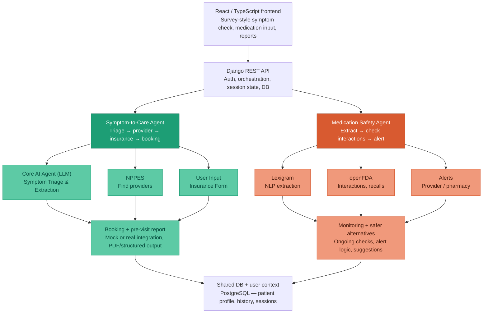

# System Architecture

## Symptom survey and LLM (frontend + Django)

The **Symptom Check** flow (`/symptom-check`) is a **three-step survey** in React: intake (free text + insurer), dynamic follow-up questions, then illustrative differentials and facility/cost sections.

- **Prompts** for the survey live in `frontend/src/symptomCheck/prompts/` (`followup_context.txt`, `results_context.txt`). The SPA loads them at build time (Vite `?raw`), sends them as `system_prompt` on each call, and sends structured `user_payload` (symptoms, insurer label, and follow-up answers on the second call).
- **Runtime:** the SPA `POST`s to **`/api/symptom/survey-llm/`** (`SymptomSurveyLlmView`) with `{ phase, system_prompt, user_payload }`, using **`apiClient`** (same base URL as the rest of the app) and **`Authorization: Bearer`** when `access_token` is in `localStorage`. Django calls the configured OpenAI-compatible or Anthropic API (keys in `.env`) and returns `{ raw_text, phase }`; the browser parses and validates JSON before rendering.
- **Two phases** (not chat-first): (1) `followup_questions` → variable `questions[]` with `input_type` for controls; (2) `condition_assessment` → conditions, severities, and **`care_taxonomy`** for future routing (logged in the browser console only for now).
- **Conversational chat** (`POST /api/symptom/chat/`) uses a separate system prompt file on the server: `api/prompts/symptom_chat_system.txt` (JSON reply with `assistant_message`, `triage_level`, etc.).

The diagram above remains the target for deeper orchestration (sessions, NPPES); the survey path already routes LLM traffic through **Django** for credential safety.