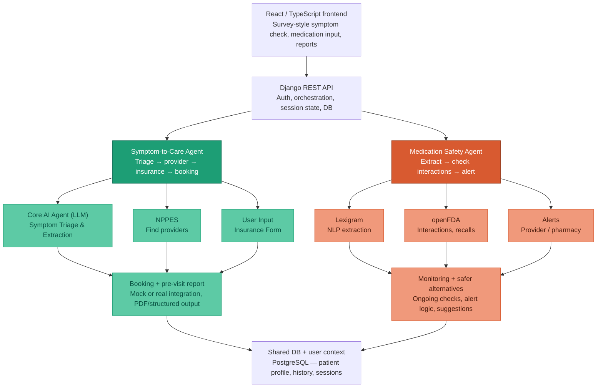

# System Architecture

## Symptom survey and LLM (implemented in frontend)

The **Symptom Check** flow (`/symptom-check`) is implemented in the React app as a **three-step survey**: intake (free text + insurer), dynamic follow-up questions, then illustrative differentials and facility/cost sections.

- **Prompts** live in versioned text files under `frontend/src/symptomCheck/prompts/` (`followup_context.txt`, `results_context.txt`). The client loads them at build time (Vite `?raw` imports), concatenates them into the `system_prompt` field of a JSON request body, and attaches structured `user_payload` (symptoms, insurer label, and follow-up answers on the second call).
- **Two LLM-shaped calls** (not chat-first): (1) after intake, generate a variable list of follow-up questions with typed controls (`single_choice`, `multi_choice`, `text`, `scale_1_10`); (2) after the questionnaire, return possible conditions, severities, and a **`care_taxonomy`** object for future server-side routing (currently logged in the browser console only; not shown in the UI).
- **Default behavior** is a **mock adapter** (no network): fixed JSON responses exercise parsing, validation, and UI. When **`VITE_SYMPTOM_LLM_URL`** is set in `frontend/.env`, the same payload is `POST`ed to that URL; the integration task can swap the mock for a Django proxy or external LLM gateway without changing the survey UX.

Longer term, the diagram above still applies: orchestration, session persistence, and authoritative triage may move behind **Django** (`API → S1 → A1`) while the frontend keeps the same JSON contracts or a thin wrapper around them.