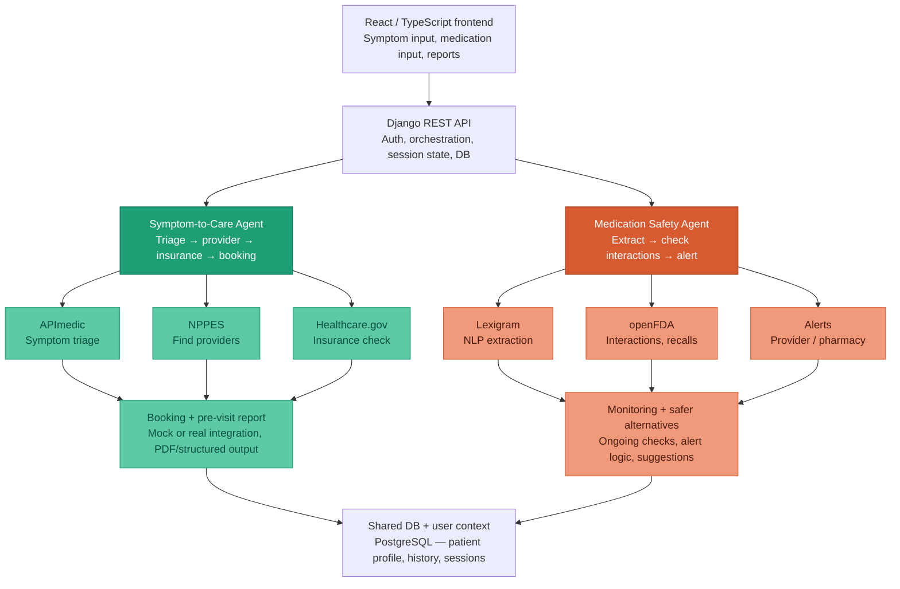

# System Architecture

```mermaid
flowchart TD
    FE["React / TypeScript frontend\nSymptom input, medication input, reports"]
    API["Django REST API\nAuth, orchestration, session state, DB"]

    FE --> API

    API --> S1["Symptom-to-Care Agent\nTriage → provider → insurance → booking"]
    API --> S2["Medication Safety Agent\nExtract → check interactions → alert"]

    S1 --> A1["APImedic\nSymptom triage"]
    S1 --> A2["NPPES\nFind providers"]
    S1 --> A3["Healthcare.gov\nInsurance check"]

    A1 & A2 & A3 --> B1["Booking + pre-visit report\nMock or real integration, PDF/structured output"]

    S2 --> B2["Lexigram\nNLP extraction"]
    S2 --> B3["openFDA\nInteractions, recalls"]
    S2 --> B4["Alerts\nProvider / pharmacy"]

    B2 & B3 & B4 --> C1["Monitoring + safer alternatives\nOngoing checks, alert logic, suggestions"]

    B1 --> DB["Shared DB + user context\nPostgreSQL — patient profile, history, sessions"]
    C1 --> DB

    style S1 fill:#1D9E75,color:#fff,stroke:#0F6E56
    style A1 fill:#5DCAA5,color:#085041,stroke:#1D9E75
    style A2 fill:#5DCAA5,color:#085041,stroke:#1D9E75
    style A3 fill:#5DCAA5,color:#085041,stroke:#1D9E75
    style B1 fill:#5DCAA5,color:#085041,stroke:#1D9E75

    style S2 fill:#D85A30,color:#fff,stroke:#993C1D
    style B2 fill:#F0997B,color:#4A1B0C,stroke:#D85A30
    style B3 fill:#F0997B,color:#4A1B0C,stroke:#D85A30
    style B4 fill:#F0997B,color:#4A1B0C,stroke:#D85A30
    style C1 fill:#F0997B,color:#4A1B0C,stroke:#D85A30
```