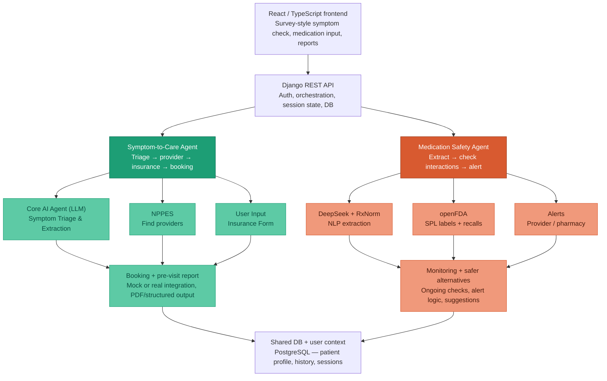

# System Architecture

## Symptom survey and LLM (frontend + Django)

The **Symptom Check** flow (`/symptom-check`) is a **three-step survey** in React: intake (free text + insurer), dynamic follow-up questions, then illustrative differentials and facility/cost sections.

- **Prompts** for the survey live in `frontend/src/symptomCheck/prompts/` (`followup_context.txt`, `results_context.txt`). The SPA loads them at build time (Vite `?raw`), sends them as `system_prompt` on each call, and sends structured `user_payload` (symptoms, insurer label, and follow-up answers on the second call).
- **Runtime:** the SPA `POST`s to **`/api/symptom/survey-llm/`** (`SymptomSurveyLlmView`) with `{ phase, system_prompt, user_payload }`, using **`apiClient`** (same base URL as the rest of the app) and **`Authorization: Bearer`** when `access_token` is in `localStorage`. Django calls the configured OpenAI-compatible or Anthropic API (keys in `.env`) and returns `{ raw_text, phase }`; the browser parses and validates JSON before rendering.
- **Two phases** (not chat-first): (1) `followup_questions` → variable `questions[]` with `input_type` for controls; (2) `condition_assessment` → conditions, severities, and **`care_taxonomy`** (NUCC taxonomy codes for routing).
- **Nearby facilities:** On the results step (after the second LLM call), the SPA calls **`POST /api/symptom/nearby-facilities/`** with the user’s validated US address (from step 1) and `taxonomy_codes` from `care_taxonomy`. Django runs **`api/services/nppes_nearby.py`**: US Census geocoding for the user and each NPPES practice location, CMS NPI Registry (NPPES) search by ZIP + taxonomy + organization (`NPI-2`), then **relevance-weighted ranking** (`api/services/nppes_relevance.py`: name/type/org heuristics; NPPES has no reviews) combined with distance, then location de-duplication. The client module `frontend/src/symptomCheck/nppesFacilitiesClient.ts` validates JSON and the page renders facilities with Google Maps links.
- **Conversational chat** (`POST /api/symptom/chat/`) uses a separate system prompt file on the server: `api/prompts/symptom_chat_system.txt` (JSON reply with `assistant_message`, `triage_level`, etc.).

The diagram above remains the target for deeper orchestration (sessions, NPPES); the survey path already routes LLM traffic through **Django** for credential safety.

### Client-side session persistence (Symptom Check survey)

The **`/symptom-check`** React page mirrors survey state to **`localStorage`** under a versioned key (`frontend/src/symptomCheck/symptomCheckSession.ts`, currently **v2** including intake **address** fields) so users can recover progress after a **refresh** or **in-app navigation** in the same browser profile. On load, if a recoverable snapshot exists, the UI offers **Resume** (restore answers and step) or **Start over** (clear storage and reset the wizard). Older **v1** snapshots are upgraded in-memory to v2 with an empty address.

- **In-flight LLM calls:** If the user leaves while `requestFollowUpQuestions` or `requestConditionAssessment` is pending, the snapshot records which phase was active. Choosing **Resume** re-sends the same API request with the saved intake or follow-up payload; this mirrors server-side stateless survey turns (`POST /api/symptom/survey-llm/`) and does not duplicate server session state.

- **Scope:** Persistence is **browser-local only** (not synced across devices or accounts). Clearing site data or using another browser profile starts fresh.

## Medication Safety UI and extraction API

The **Medication Safety** area (`/medication-safety`) lets signed-in users build an **active regimen** from free text. The flow is implemented in React (`frontend/src/pages/MedicationSafetyPage.tsx`, add-prescription UI in `frontend/src/medicationSafety/AddPrescriptionModal.tsx`) and uses the same **`apiClient`** + JWT pattern as the rest of the app.

- **Extraction:** On “Identify medication”, the client `POST`s to **`/api/medication-profile/extract/`** (`MedicationProfileExtractView` in `api/views_medication.py`) with `{ medications_text: "<user text>" }`. Django runs **`extract_medications_with_rxnorm`** (`api/services/medication_extraction.py`): the LLM prompt is `api/prompts/medication_extract_system.txt` (JSON object with a `medications` array of `{ common_name, scientific_name, rxnorm_id }`, plus legacy `name` still accepted by the parser). RxNorm lookup prefers **scientific** over **common** names, then RxNav. The server persists a **`MedicationProfile`** row per request and returns `extracted_medications` in the JSON response. When two or more drugs are extracted in one request, the server also runs **`compute_pairwise_interactions`** (`api/services/openfda_interactions.py`) and stores the result on `interaction_results`. The UI shows **common** (brand/familiar) large and **scientific** (generic/INN) smaller when both differ; if only one is returned, a **single** title line is shown. The UI uses the first extracted drug for the add flow (if several are returned, an informational notice lists the others). Errors from the LLM layer surface as **502** with `{ "error": "..." }`; missing server keys as **503**; empty input as **400**.
- **Regimen details:** After extraction, the user can submit optional fields (dosage in mg, frequency, time to take, refill horizon). Empty optional fields render as **`-`** on the list.
- **Persistence:** The active regimen (including optional fields and a client-generated id for routing) is stored in **`localStorage`** under `healthagent_active_regimen_v1` (`frontend/src/medicationSafety/medicationRegimenStorage.ts`) so the list survives refresh in the same browser; it is not synced to the server or other devices. Each successful extract call still creates a **`MedicationProfile`** record for audit/backend use.
- **Detail and removal:** `/medication-safety/med/:medicationId` (`MedicationSafetyDetailPage.tsx`) loads one entry from the same storage for edit; **Remove** opens an in-app confirmation dialog before deleting locally.

- **Regimen safety (openFDA, no LLM):** When the regimen is non-empty, the page `POST`s to **`/api/medication/regimen-safety/`** (`RegimenSafetyView`) with `{ medications: [{ name, rxnorm_id?, scientific_name?, common_name? }, ...] }` derived from local storage (scientific/common names improve openFDA label matching). The backend runs **`run_regimen_openfda_check`** (`api/services/regimen_safety_service.py`): **`compute_pairwise_interactions`** fetches SPL labels from the openFDA **`drug/label.json`** endpoint (cached per process), derives pairwise interaction hints from FDA section 7–style text with **severe / moderate / mild** heuristics, attaches **per-drug** SPL excerpts (boxed warning, contraindications, adverse reactions, drug interactions, and related fields), then **`fetch_recalls_for_medications`** and **`compute_safety_score`**. Pairwise conflicts populate **`DrugInteractionConflictsPanel`** on the medication list page; per-drug label/recall summaries are on the medication detail route (`MedicationDetailSafetyPanel`). This endpoint does **not** write a `MedicationProfile` row. Full medication safety with LLM extraction is also available as **`POST /api/medication/check/`** (`MedicationCheckView`), which persists a profile like extract-only.

The right-hand **safer alternatives** panel remains placeholder messaging until that feature is implemented.